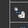
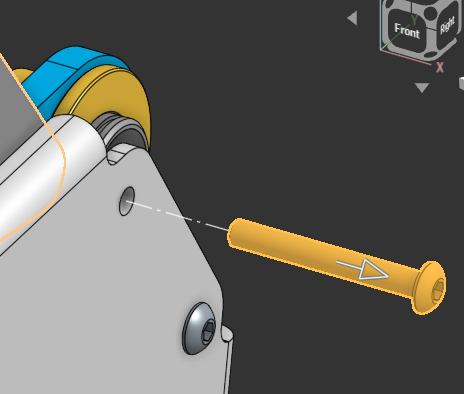
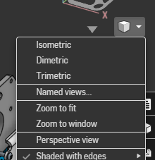
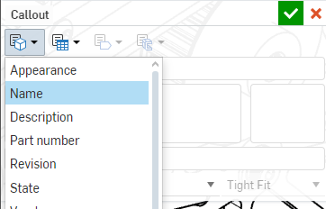

# Mechanism Assembly Guides

Mechanism Assembly Guides

To make assembling subsystems simpler, easier, and faster, we use Mechanism Assembly Guides. This is in order to help any who may have not worked on the cad, assemble it correctly and in the proper order it was meant to be assembled in. These guides are basically lego build manuals but for FRC subsystems. 

The key to creating these guides is to work backwards. Starting with your full assembly and slowly taking off pieces in the inverse order you’d be assembling them. 

Step by Step process

1: Export the full assembly to a new onshape document. (Use .step file)

2: Copy your main assembly into a new onshape folder called Steps. (Name "Step 1")

3: Figure out which parts are going to be the last to put on. (Think bolts, and the easiest parts to take off.)

4: Once you have that figured out, create an exploded view. (On the right side bar, under configurable parts.)

Click add exploded view, and click on one of your decided parts, and drag it away from the model in a way that it would be put on. (Drag bolts straight out)

Repeat with all parts in the step
Hit done editing explode

5: (Optional) To create the actual guide we use onshape drawings, and they only have the isometric view standard. If you need another view, rotate your onshape model to that view. Press the dropdown box under the view cube. And select named views. Name the view to your step, and press the plus button.

6: Duplicate the Step 1 Assembly. Open the new assembly name Step 2, find the parts that were a part of the exploded view, and delete them.

7: Repeat steps 3-6 over and over with each new step until you fully disassemble your assembly. 

Things to note: If you have sub assemblies, make sure they get a page or more for how to assemble them.

8: Create a new folder labeled drawings.

9: Create a new drawing, and delete everything within the title block(leave the border)

10: Insert your Step 1 Assembly, and select either isometric or the named view associated with that step. 
Size the assembly until you have a good amount of zoom on where the parts are being placed(You don’t necessarily have to fit the entire assembly onto each sheet). 
Make sure you select the exploded view under exploded/position
Once it's placed, put a call out on each of the parts being placed. Confirm the callout, go back in, change the bottom dropdown from Circle to None, as well in the main box put the part property name. This should automatically put the name in the callout.

11: create a table wherever there is room with 2 columns and 1 more row than there are parts in the step. Label the first row Part, and the second Quantity, fill in the remaining rows with the part names, and their quantities within the step. 

12: under the sheets tab duplicate sheet 1

13: delete the table and assembly from your new sheet

14: Repeat steps 10 through 13 for each step in descending order. 

Once you have created all of the sheets, in a new drawing insert the full assembly and add a title, print off the cover, and the assembly drawing. Make sure the pages are in the correct order before stapling all of them together and putting them within their respective subsystem bin. 
