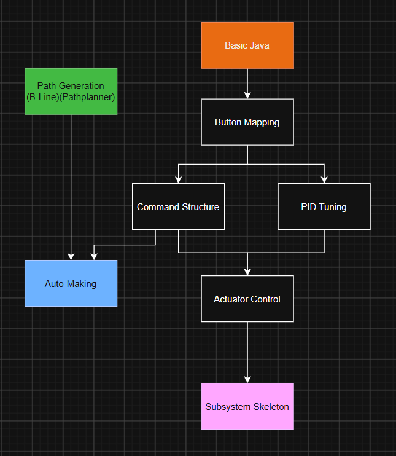

#  Getting Started

Welcome to the software team! This section is designed to have you working on real programming as smooth as possible. It provides a guidelines path to learning FRC Software, as well as some starter projects to guide your journey. There will also be links to other resources to assist you.

The pathway to learning software is provided below. This can be used as a template and doesn't have to be strictly followed, but is built in a way to make it easy to transition to the next project. Every project is built as a starting point, not an ending point, and we encourage you to continue exploring more options as you keep learning. Not every project has to completed in order to contribute to the team.



## Basic Java

Java is the main programming language used by FRC teams to program their robots. To learn Java, there are many resources online (courses, videos, guides) that can help you.

The most important parts to understand before starting on the robot:

- Variables
- Data Types
- Operators
- Booleans
- If statements & switch statements
- Classes (modifiers, abstraction, inheritence)
- Objects
- Constructors
- Packages & APIs

You don't need a mastery of these subjects, but a basic understanding to use them. Even when you are working on the robot, you will still be looking up definitions.

Reccomended Resources:

- [W3Schools](https://www.w3schools.com/java/default.asp). Best for simple instruction
- [FRCSoftware](https://frcsoftware.org/learning-course/stage0/stage-overview/). Only need to do Stage 0 for basic Java
- [CodingBat](https://codingbat.com/java). Good for practice exercises if wanted

## Basic Java Project
#### Simple Calculator 
Your task is to create a simple calculator that can do the following tasks:

- Add
- Subract
- Divide
- Multiply
- Exponent/Power
- Factorial

Using [Java's Scanner](https://www.w3schools.com/java/java_user_input.asp) class, ask the user which operation they would like to complete, then ask for the numbers to complete that operation.

Your output could look similar to this:
```
What operation would you like to complete?
addition
Enter 1st number
3
Enter 2nd number
5
Your solution is 8
```

Each operation should have a method that does does the calculation and returns a number to be used for the output.

Here is the example for addition:
```java
private static int add(int a, int b) {
    int c = a + b;
    return c;
}
```

To complete the project, you can use an [online java compiler](https://onecompiler.com/java) or you can run java locally on a computer.

After you finish the project you can add extra features to keep testing yourself

- Save numbers after each attempt (like the answer button on the calculator)
- Throws an error if the user doesn't type a number in
- Gives a short guide if the user types "help"
- Add more operations (mean, square root, absolute value)

After you feel comfortable with java, it's time to start actual work on the robot! If you are using your own computer, make sure to [download all the required tools ](Installation.md)to build your own robot code. Start with either [path generation](Path-Generation.md) or [button mapping](Button-Mapping.md) to work on the robot
