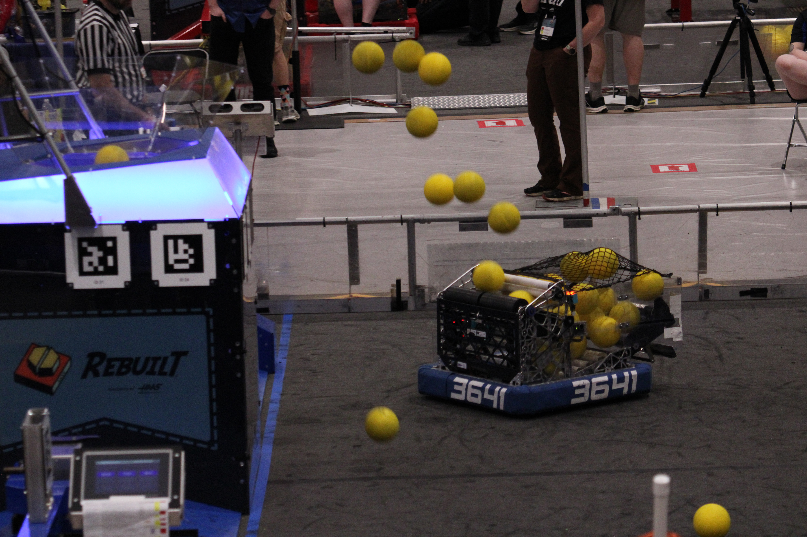

# Programming Introduction

## Why do software for The Flying Toasters?

- FRC Software encompasses all software/firmware parts of the robot, from the autonomous to the control of the motors
- develop problem-solving skills to writing code, testing it, and debugging software
- Drive the robot without needing to drive for competition!
- Utilize many AI tools to assist and write software
- The Flying Toasters are super competitive, so expect the robot to be very well designed and built, with the ability to make very fun software!

## What prior experience is needed?

- No prior experience in any form of programming is necessary, however it is helpful to know a bit of Java
- Learning to use github is good to work with other team-members
- Be willing to cooperate and learn as much as possible!

## How do I be successful doing FRC Software?

- Ask, ask, ask questions. Senior members are there to help and assist you in any way they can
- Be present in meetings, and always be ready to learn more
- Do and understand starter projects. AI Tools are always helpful but do not overuse to prevent your learning.
- Learn to read documentation. There's a lot of FRC resources out there with plenty of examples to learn from
- LEARN FROM OTHER TEAMS. Every team does their software differently, and they might do something better than us

## Where do I start

Go to [the learning introduction page](Getting%20Started/Intro.md) to start learning software. Remember to ask questions if you are confused.
